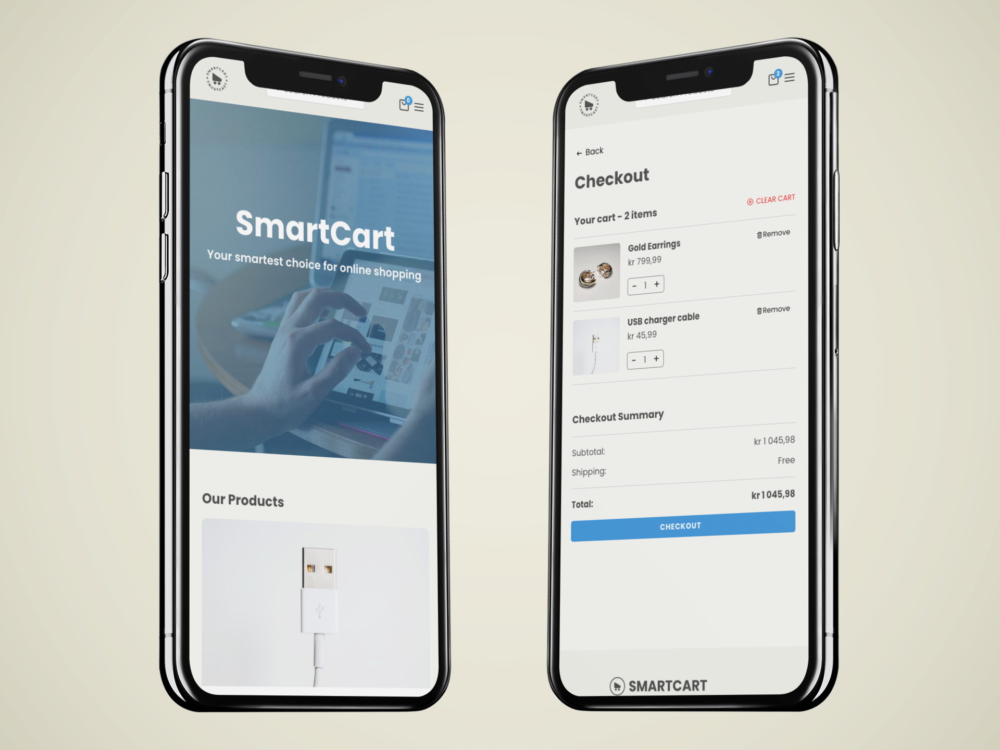

# SmartCart

## Overview

SmartCart is an eCommerce web application designed to mimic a real-world online store experience. This project was completed as a part of the JavaScript Frameworks course at Noroff, where React.js was the core technology.

### Hosted on Netlify
[Live site](https://smartcart-js-frameworks.netlify.app/)

## Description

The SmartCart application provides a variety of features to offer a seamless shopping experience for its users:

    Displaying a list of products on the homepage.
    Individual product pages with detailed information, including title, description, image, and reviews if available.
    Adding items to the cart from the product page.
    A cart page listing all added products with a total cost, and a checkout option.
    A checkout success page indicating a successful order placement and offering a link to go back to the store.
    A contact page with a form ensuring data validation.
    Using React Router to navigate between pages.
    A responsive design that works across different device types.

The project's aim was to apply the knowledge of React.js gained during the course and create a practical, real-world-like web application.

## Built With
- [React.js](https://react.dev/) - This project was bootstrapped with Create React App.
- [Zustand](https://www.npmjs.com/package/zustand) - Used for managing the cart state in the application.
- [Styled Components](https://styled-components.com/)
- [Noroff Online shop API](https://noroff-api-docs.netlify.app/basic-endpoints/online-shop)
    
### Key Libraries and Packages
- React Icons - Used for implementing icons in the application.
- React Toastify - Used for displaying notifications to the user.

## Getting Started

### Prerequisites

This project was bootstrapped with Create React App, which requires Node >= 10.16 and npm >= 5.6 on your local development machine. Make sure to install them if you haven't already.

### Installing

To get the project running on your local machine, follow these steps:

Clone the repository rom GitHub and install the dependencies by running

    npm i

### Running

To run the app on your local machine, execute the following command:

    npm start

This will start the application and it will be available on http://localhost:3000.

## Contact

To get in touch, you can reach me via:

[Email](mailto:maytoveh@gmail.com)
[LinkedIn](https://no.linkedin.com/in/may-tove-hovdal-24b406153)
